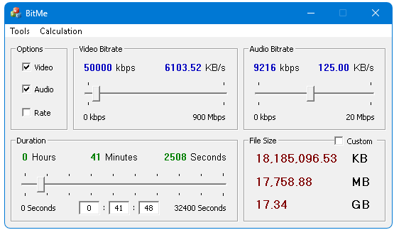

BitMe is a bitrate calculator with a different, perhaps whimsical appearance.

The program goes back a long time. The first version, "The Bitrate Calculator," later BitMe, was written in secondary school (2003 or 2004). It was put together in Visual Basic and certainly looked pretty, but I wanted something better. Later, when I learnt C++, I rewrote it, helped by MFC, releasing version 2.1.1 on SourceForge in November 2007.

In 2013, I wrote BitMe from scratch again; this had a sounder architecture but kept the old appearance. Then, in 2016, I tackled the challenge of adding support for any container or codec. Unfortunately, this work was incomplete and I did not touch it until 2021. Cutting out the idea of working with any codec, and using an approximate method, I simplified the system, keeping the idea of various containers and adding more. It is working, but will benefit from more tuning and containers.
