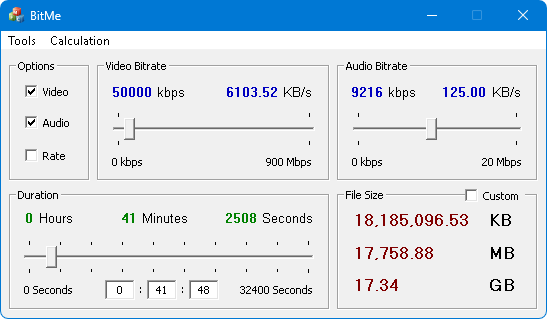

BitMe
=====

A bitrate calculator with a different, whimsical appearance.

The program goes back a long time. The first version, *The Bitrate Calculator,* later BitMe, was written in secondary school (2003 or 2004). It was put together in Visual Basic and looked pretty, but I wanted something better. Later, learning C++, I rewrote it, helped by MFC, releasing version 2.1.1 on SourceForge in November 2007. In 2013, I wrote BitMe from scratch again; this had a sounder architecture but kept the old appearance. In 2016, I tackled the challenge of adding support for any container or codec. Unfortunately, this work was left incomplete, and I did not touch it until 2021, when, cutting out codecs and using an approximate method, I simplified the system, keeping the concept of containers and adding more. It is working but will benefit from more tuning.

Notes
-----

The program comes with a default language of English and can be translated into others. To do so, open the "English.lng" file in a plain-text editor, like Notepad, and translate all the words on the right-hand side of the equal-to sign (=). Then, save it as another file, using UTF-8 encoding without the byte-order mark, or plain ANSI. Lastly, rename the file to that of the language: "French.lng" for example. The extension must be ".lng" for the file to be recognised.

Download BitMe only from its [official page](https://github.com/GeoffreyAA/bitme). This is free software; do not pay for it anywhere.

Building
--------

BitMe can be compiled with Visual Studio 2026. Open the solution file, BitMe.sln, set the configuration, and compile; it is set to link statically, so no redistributable files are needed. MFC must be installed:

	C++ MFC for x64/x86 (Latest MSVC)

To target XP, use the "Release-XP" configuration. The following components must be installed:

	C++ Windows XP Support for VS 2017 (v141) tools
	MSVC v141 - VS 2017 C++ x64/x86 build tools (v14.16)
	C++ MFC for v141 build tools (x86 & x64)